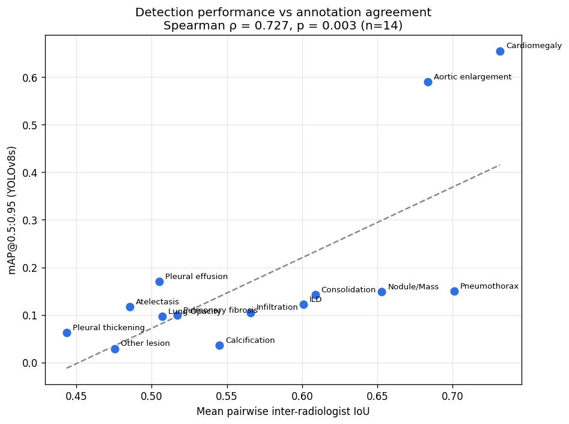

# Chest X-Ray Abnormality Detection

An end-to-end deep learning system that detects 14 thoracic abnormalities in chest X-rays — and an investigation into what actually limits its performance.

> ⚠️ **Educational / research demonstration only. Not a diagnostic device. Not validated for clinical use and must not be used for medical decisions.**

## 🔗 Live Demo

**[huggingface.co/spaces/rocky17435/xray-detection](https://huggingface.co/spaces/rocky17435/xray-detection)**

Upload a chest X-ray (PNG, JPG, or DICOM) and the model returns detected findings with bounding boxes and **calibrated** confidence scores.

## 📄 [Read the Technical Report →](TECHNICAL_REPORT.md)

The full study: methodology, calibration, explainability, a controlled architecture comparison, and the agreement analysis.

---

## Overview

Multi-class object detection over 14 thoracic findings, using the VinDr-CXR / VinBigData chest X-ray dataset. The project covers the full lifecycle — data engineering, training, evaluation, API, frontend, and live deployment — but the substantive contribution is the evaluation: four hypotheses tested for why per-class performance varies, three rejected and one confirmed against independent ground truth.

## Results

Both models evaluated on the same held-out test split (660 images), identical inputs and metric:

| | Faster R-CNN | YOLOv8s (deployed) |
|---|---|---|
| Parameters | 41.3M | 11.1M |
| mAP@0.5 | 0.290 | **0.348** |
| mAP@0.5:0.95 | 0.132 | **0.180** |

YOLOv8s wins on all 14 classes with ~27% of the parameters — yet the same twelve classes remain unusable in both (Calcification 0.036, Other lesion 0.029). A better architecture lifts performance across the board without changing which findings the model can actually detect.

## Key findings

**Performance is bounded by inter-radiologist agreement, not by data or architecture.** Three explanations were tested and rejected: training-set size (ρ = +0.055, p = 0.85), input resolution, and detector architecture. What holds is how much radiologists agree on lesion location — ρ = +0.727 against the training split, and **ρ = +0.802 (p = 0.0006) against the official 5-radiologist consensus test set**, which shares no annotators with the training data. The implication is that reported per-class numbers on low-agreement findings measure label consistency as much as model capability.

**Both models were badly miscalibrated — in opposite directions.** Faster R-CNN was over-confident: at 75% claimed confidence it was correct 40% of the time. Temperature scaling failed (T=1.018, 0.7% improvement) because the miscalibration is non-uniform across the confidence range; isotonic regression cut calibration error by **91%**. YOLOv8s showed the reverse — systematic *under*-confidence, with raw 0.35 scores correct 62% of the time — and isotonic calibration cut its ECE by **93.7%**. Calibrated output is capped at 0.95 to avoid claiming a certainty the data doesn't support, and is live in the deployed demo.

**Failure analysis and attention mapping** independently confirm the same picture: the model localises the two well-performing findings accurately and produces false positives on the rest.

## Architecture

| Layer | Technology |
|-------|-----------|
| Models | Faster R-CNN (ResNet-50 FPN) and YOLOv8s, PyTorch |
| Label fusion | Weighted Boxes Fusion (multi-radiologist consensus) |
| Calibration | Isotonic regression, fitted on held-out validation |
| Deployed model | YOLOv8s, single-pass inference (~7 ms/image) |
| Inference (Faster R-CNN) | Test-Time Augmentation (hflip + WBF) |
| API | FastAPI — JSON detections, annotated images, DICOM support |
| Frontend | React + Vite — canvas rendering, threshold slider, class filters |
| Deployment | Gradio on Hugging Face Spaces |

## Engineering practices

- 7 endpoint tests covering happy paths and error cases (`test_api.py`), running in CI on every push
- Input validation: size limits, extension checks, graceful error handling
- Calibration validated on held-out data before deployment
- Version-independent artifact storage (JSON curve rather than pickled model)
- ONNX export verified bit-exact against the reference implementation, then rejected on measured evidence rather than deployed by default
- Honest scoping and documented limitations throughout

## Limitations

- Trained on a 3,075-image subset; correcting this would not be expected to help, since per-class performance does not correlate with training-set size
- Twelve of fourteen classes are unreliable, and the evidence indicates this reflects annotation agreement rather than a fixable model or data deficiency
- Not clinically validated; no regulatory clearance — educational demonstration only
- Calibration is fitted to this dataset's distribution and would need refitting elsewhere
- The agreement analysis covers 14 classes; n is small and the consensus evaluation used a 300-image subsample

See [MODEL_CARD.md](MODEL_CARD.md) for intended use and ethical considerations.

## Repository structure

Model weights are hosted on the Hugging Face Space (not in this repo, due to size).

## Tech stack

Python · PyTorch · torchvision · Ultralytics · FastAPI · React · Vite · Gradio · Hugging Face Spaces
