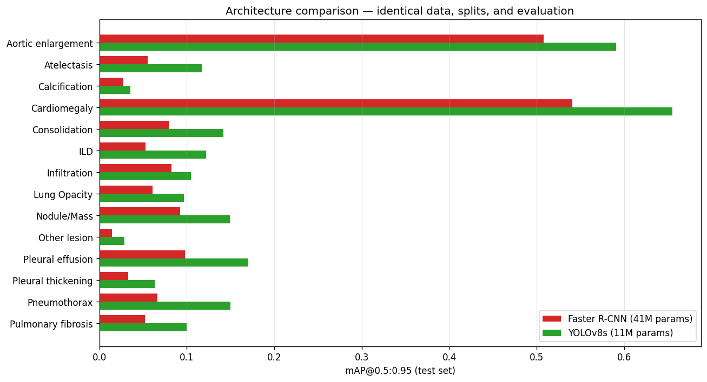
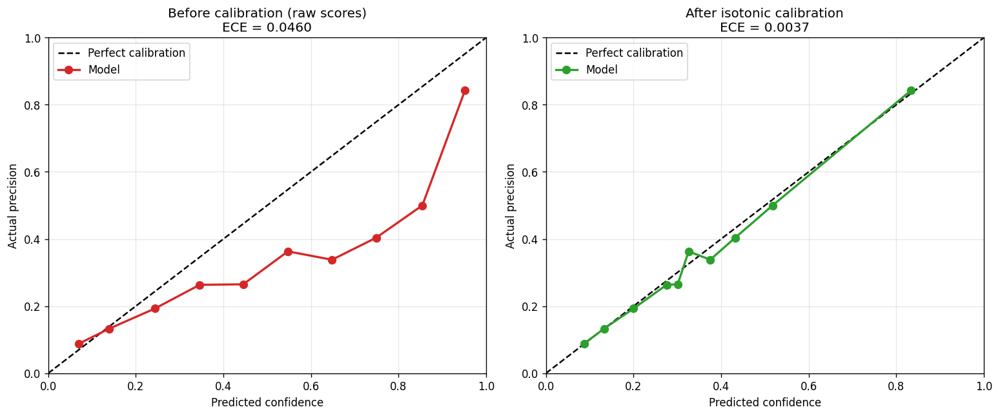

# Chest X-Ray Abnormality Detection

[](https://github.com/abhishekjaden/chest-xray-detection/actions/workflows/tests.yml)

An end-to-end deep learning system that detects 14 thoracic abnormalities in chest X-rays — with a rigorous evaluation of *why* it performs as it does.

> ⚠️ **Educational / research demonstration only. Not a diagnostic device. Not validated for clinical use and must not be used for medical decisions.**

## 🔗 Live Demo

**[huggingface.co/spaces/rocky17435/xray-detection](https://huggingface.co/spaces/rocky17435/xray-detection)**

Upload a chest X-ray and the model returns detected findings with bounding boxes and **calibrated** confidence scores.

## 📄 [Read the Technical Report →](TECHNICAL_REPORT.md)

The full study: methodology, per-class analysis, calibration, explainability, and a controlled architecture comparison.

---

## Overview

Multi-class object detection over 14 thoracic findings, using the VinBigData Chest X-ray dataset. The project covers the full lifecycle — data engineering, training, evaluation, API, frontend, and live deployment — but the substantive contribution is the evaluation: four independent lines of evidence establishing that **data scarcity, not model architecture, is the binding performance constraint.**

## Results

Both models evaluated on the same held-out test split (660 images), identical inputs and metric:

| | Faster R-CNN | YOLOv8s |
|---|---|---|
| Parameters | 41.3M | 11.1M |
| mAP@0.5 | 0.290 | **0.348** |
| mAP@0.5:0.95 | 0.132 | **0.180** |



YOLOv8s wins on all 14 classes with ~27% of the parameters — yet data-scarce classes remain unusable in both (Calcification 0.036, Other lesion 0.029). A better architecture lifts everything but cannot manufacture signal from 15 training examples.

## Key findings

**Performance tracks training-set size.** Cardiomegaly (~700 images) reaches 0.54 mAP@0.5:0.95; Other lesion (~15 images) reaches 0.014. Two classes work; twelve don't.

**Both models were badly miscalibrated — in opposite directions.** Faster R-CNN was over-confident: at 75% claimed confidence it was correct 40% of the time. Temperature scaling failed (0.7% improvement) because the miscalibration is non-uniform across the confidence range; isotonic regression reduced calibration error by **91%**. YOLOv8s showed the reverse problem — systematic *under*-confidence, with a raw 0.35 score correct 62% of the time — and isotonic calibration reduced its ECE by **93.7%**. Calibrated output is capped at 0.95 to avoid claiming a certainty the data doesn't support, and is live in the deployed demo.



**Failure analysis and attention mapping** independently confirm the same picture: the model localises well-represented findings accurately and produces false positives on classes it has barely seen.

## Architecture

| Layer | Technology |
|-------|-----------|
| Models | Faster R-CNN (ResNet-50 FPN) and YOLOv8s, PyTorch |
| Label fusion | Weighted Boxes Fusion (multi-radiologist consensus) |
| Calibration | Isotonic regression, fitted on held-out validation |
| Deployed model | YOLOv8s, single-pass inference (~7 ms/image) |
| Inference (Faster R-CNN) | Test-Time Augmentation (hflip + WBF) |
| API | FastAPI — JSON detections, annotated images, DICOM support |
| Frontend | React + Vite — canvas rendering, threshold slider, class filters |
| Deployment | Gradio on Hugging Face Spaces |

## Engineering practices

- 7 endpoint tests covering happy paths and error cases (`test_api.py`)
- Input validation: size limits, extension checks, graceful error handling
- Calibration validated on held-out data before deployment
- Version-independent artifact storage (JSON curve rather than pickled model)
- Honest scoping and documented limitations throughout
- ONNX export verified bit-exact against the reference implementation, then rejected on measured evidence rather than deployed by default

## Limitations

- Trained on a 3,075-image subset; twelve of fourteen classes are effectively undetectable
- Not clinically validated; no regulatory clearance — educational demonstration only
- Calibration is fitted to this dataset's distribution and would need refitting elsewhere
- Out-of-distribution performance untested

See [MODEL_CARD.md](MODEL_CARD.md) for intended use and ethical considerations.

## Repository structure

```
├── TECHNICAL_REPORT.md   full study
├── MODEL_CARD.md         intended use, limitations, ethics
├── analysis/             figures and result data
├── model.py, main.py     FastAPI inference service
├── test_api.py           endpoint tests
└── src/                  React frontend
```

Model weights are hosted on the Hugging Face Space (not in this repo, due to size).

## Tech stack

Python · PyTorch · torchvision · Ultralytics · FastAPI · React · Vite · Gradio · Hugging Face Spaces
