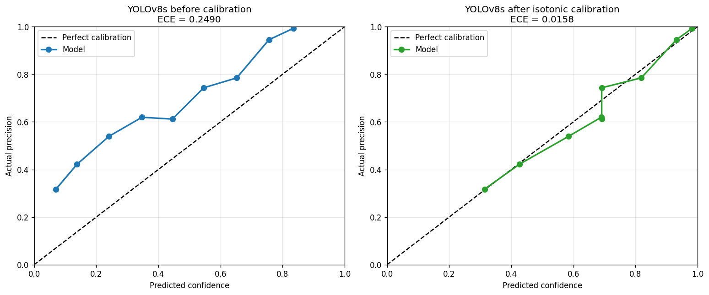

# Technical Report: Chest X-Ray Abnormality Detection

An end-to-end study of object detection for thoracic abnormalities in chest radiographs, covering model development, deployment, and — the main contribution — a rigorous evaluation of *why* the model performs as it does.

> **Educational / research demonstration only. Not a diagnostic device. Not clinically validated.**

**Live demo:** https://huggingface.co/spaces/rocky17435/xray-detection (YOLOv8s, isotonic-calibrated)

---

## 1. Problem and Data

Multi-class object detection over 14 thoracic findings, using the VinBigData Chest X-ray dataset.

**Label fusion.** Each image carries annotations from multiple radiologists, who frequently disagree on both presence and extent of findings. Rather than treating each annotation as independent ground truth, overlapping boxes were merged with Weighted Boxes Fusion, reducing 36,096 raw annotations to 22,719 consensus boxes (a 37% reduction).

**Splits.** Stratified into 3,075 train / 659 validation / 660 test images. All results are measured on the held-out test split unless stated otherwise.

**Class imbalance.** Roughly 65:1 within the sampled subset — Aortic enlargement in 974 images, Atelectasis in 15. This appeared to be the central constraint, and Section 3 tests that assumption against the full dataset.

---

## 2. Model Development

Two detectors were trained on identical data and splits.

**Faster R-CNN** (ResNet-50 FPN, 41.3M params), COCO-pretrained. Class-balanced sampling oversampled rare-finding images up to 28×. Validation loss bottomed at epoch 4 and rose thereafter while training loss kept falling — clear overfitting, so the epoch-4 checkpoint was selected. Test-time augmentation (horizontal flip + WBF fusion) improved mAP@0.5:0.95 from 0.126 to 0.132 at no training cost.

**YOLOv8s** (11.1M params), COCO-pretrained, same 512px inputs and splits. Trained 46 epochs with early stopping (best at 36), default Ultralytics augmentation, single-pass inference.

| | Faster R-CNN | YOLOv8s |
|---|---|---|
| Parameters | 41.3M | 11.1M |
| mAP@0.5 | 0.290 | **0.348** |
| mAP@0.5:0.95 | 0.132 | **0.180** |
| Inference | two-pass + WBF | ~7 ms/image |

Both are comparable to or better than published competition baselines for this dataset. **YOLOv8s is the deployed model.**

---

## 3. Per-Class Analysis

Overall mAP conceals a two-tier structure (YOLOv8s, mAP@0.5:0.95):

| Class | Images (full train set) | Median box area (px²) | Positional spread (px) | mAP |
|---|---|---|---|---|
| Cardiomegaly | 2,316 | 396,385 | 322 | 0.655 |
| Aortic enlargement | 3,098 | 96,503 | 277 | 0.590 |
| Pleural effusion | 1,038 | 62,367 | 925 | 0.170 |
| Pneumothorax | 96 | 530,909 | 808 | 0.150 |
| Nodule/Mass | 841 | 10,012 | 803 | 0.149 |
| Consolidation | 353 | 235,992 | 658 | 0.142 |
| ILD | 397 | 548,439 | 715 | 0.122 |
| Atelectasis | 187 | 272,439 | 704 | 0.117 |
| Infiltration | 613 | 244,912 | 730 | 0.105 |
| Pulmonary fibrosis | 1,621 | 75,729 | 761 | 0.099 |
| Lung Opacity | 1,331 | 151,715 | 742 | 0.097 |
| Pleural thickening | 2,010 | 31,330 | 1,058 | 0.063 |
| Calcification | 458 | 27,206 | 764 | 0.036 |
| Other lesion | 1,154 | 119,592 | 852 | 0.029 |

**An initial hypothesis — that performance is limited by training-set size — was tested against the full VinDr-CXR annotations and does not hold.**

| Variable vs mAP@0.5:0.95 | Spearman ρ | p |
|---|---|---|
| Training images | +0.055 | 0.85 |
| Median box area | +0.292 | 0.31 |
| Positional spread | −0.433 | 0.12 |
| Boxes per image | +0.233 | 0.42 |

Training-set size shows no relationship with performance (ρ = +0.055, p = 0.85). The clearest counter-example: Pleural thickening has 2,010 training images and scores 0.063, while Cardiomegaly has 2,316 and scores 0.655 — near-identical volume, tenfold difference. Pneumothorax scores 0.150 on 96 images, the second-fewest in the dataset.

Positional spread — the standard deviation of annotation centroids, a proxy for anatomical constraint — shows the strongest association and in the expected direction (ρ = −0.433), but **does not reach significance at n = 14**. The two best-performing classes are the two occupying fixed anatomical positions: the heart and the aortic knob are always in the same place, so the detector measures rather than searches. This is suggestive, not established.

**The honest conclusion is that data volume does not explain the failures, and what does remains unproven.** With only 14 classes, the analysis lacks power to distinguish among candidate explanations. The positional-spread measure is also computed in raw DICOM coordinates without normalising for image dimensions, so some spread reflects image-size variation rather than anatomical variation.

---

## 4. Evidence 1 — Qualitative Failure Analysis

Ground truth (green) beside predictions (red) across test images shows a consistent pattern:

- **Well-represented classes are detected accurately and localised tightly.** Cardiomegaly and Aortic enlargement predictions closely match ground truth.
- **The persistently failing classes produce false positives.** On difficult images the model floods the field with low-confidence boxes for Pneumothorax, Other lesion, and Pleural thickening — findings it detects poorly regardless of how many training examples exist for them.

The failure mode is not "missing findings" but "guessing" on classes it never learned.

---

## 5. Evidence 2 — Confidence Calibration

If a model is guessing on rare classes, its confidence scores should be untrustworthy. Both models were poorly calibrated — in opposite directions.

**Method.** Every prediction above 0.05 was scored for correctness (IoU > 0.4 against a same-class ground-truth box) and binned by confidence. Calibrators were fitted on the validation split and evaluated on test.

### Faster R-CNN: over-confident

24,457 test predictions. Expected Calibration Error was 0.046 overall — but misleading, because 73% of predictions fall below 0.2 confidence where the model happens to be well calibrated. Restricted to actionable predictions (≥ 0.25), **ECE was 0.155**: a prediction claiming 75% confidence was correct only 40% of the time.

**Temperature scaling failed.** T = 1.018, a 0.7% ECE reduction — essentially nothing. The reason is diagnostic: temperature scaling applies a single monotonic transform, but the miscalibration here is *non-uniform* — accurate at both extremes, badly over-confident in the middle. No single temperature corrects that shape.

**Isotonic regression worked.** Non-parametric, so it fits an arbitrary monotonic mapping.

| | ECE (all) | ECE (score ≥ 0.25) |
|---|---|---|
| Raw | 0.0460 | 0.1554 |
| Temperature scaling | 0.0457 | — |
| **Isotonic** | **0.0037** | **0.0140** |

### YOLOv8s: under-confident

6,754 test predictions — 3.6× fewer than Faster R-CNN, at more than double the precision (0.458 vs ~0.20). A far less trigger-happy detector.

But its scores understate its accuracy at every level: raw 0.07 was correct 32% of the time, raw 0.35 was correct 62%, raw 0.83 was correct 99%. Raw ECE 0.249; isotonic calibration reduced it by **93.7% to 0.016**.

The curve sits *above* the diagonal — the visual signature of under-confidence, mirroring Faster R-CNN's sag below it. Same fix, opposite direction.

**Output is capped at 0.95.** The uncapped fit mapped high scores to a literal 1.0, but that estimate rested on 4 test samples in the top bin — not statistically supported, and inappropriate to display as certainty in a medical context. The cap costs 0.0012 ECE, a trade worth making.

**Known limitation:** the fit has flat regions where distinct raw scores collapse to the same calibrated value (0.35 and 0.55 both → 0.69), from monotonicity enforcement through noisy mid-range bins.

**Deployed.** The YOLOv8s calibrator is live. It is stored as a plain JSON curve (`np.interp` lookup) rather than a pickled model object — version-independent and dependency-free, after an sklearn version warning on the original pickle showed that fragility was real.

Calibration does not improve detection accuracy; mAP is unchanged. It makes the confidence numbers honest, which for a medical demonstration matters independently.

---

## 6. Evidence 3 — Spatial Attention

Backbone feature-activation mapping (measured on Faster R-CNN) shows the model attends to thoracic anatomy — cardiac silhouette and lung fields — rather than image borders or artifacts. It has learned anatomically meaningful features.

Attention is *diffuse* rather than sharply localised, consistent with the over-prediction seen in the failure analysis.

---

## 7. Evidence 4 — Architecture Comparison

The strongest test of the data-scarcity hypothesis is interventional: change the architecture and see whether the limitation persists.

**Setup.** Identical data, splits, 512px inputs, and metric, on the same 660 test images.

YOLOv8s outperforms Faster R-CNN **on all 14 classes** with roughly a quarter of the parameters.

**But the limitation persists.** Absolute gains concentrate in well-represented classes (Cardiomegaly +0.114, Aortic enlargement +0.083), while data-scarce classes remain unusable: Calcification 0.036, Other lesion 0.029. In relative terms the rare classes improved as much or more — Atelectasis and Pneumothorax both roughly doubled — but from a base so low that doubling changes nothing practical.

**Conclusion:** a substantially better architecture lifts performance across the board but does not change which classes fail. Architecture is not the binding constraint. Section 3 shows that data volume isn't either — the same twelve classes fail in both models regardless of how many training examples they have.

*Caveat: the two models were trained with their conventional recipes (different epoch counts, augmentation stacks, and TTA), so this compares architectures as normally trained rather than isolating architecture alone.*

---

## 8. Engineering

**Serving.** The deployed demo runs YOLOv8s on Hugging Face Spaces via Gradio, accepting PNG, JPG, and DICOM. A FastAPI service provides JSON detections, an annotated-image endpoint, DICOM support, and input validation with size limits and graceful error handling. A React frontend adds client-side threshold filtering and per-class toggles.

**Model swap.** Moving from Faster R-CNN to YOLOv8s required refitting calibration against the new score distribution — the previous curve was fitted to a different model and would have produced wrong confidences. The inference engine was rewritten while keeping the public interface identical (`predict`, `draw_detections`, `read_dicom`), so the API, tests, and demo needed no changes. The existing test suite served as the regression check.

**ONNX export — evaluated, not deployed.** The model was exported to ONNX (opset 12, fixed 512×512 input) with post-processing — anchor-free box decoding and per-class NMS — reimplemented from the raw `(1, 18, 5376)` output. Verified against ultralytics on test images: identical classes, identical scores, **0.00px maximum box difference** across all detections. Benchmarked at 163.9 ms/image versus 186.7 ms for ultralytics on CPU — a 1.14× speedup.

It was not deployed. The speedup is immaterial for single-image interactive use, the ONNX file is larger (42.6 MB vs 22.5 MB), and replacing library-maintained post-processing with hand-written decoding introduces maintenance risk against a calibration curve fitted to ultralytics' NMS behaviour. The export script and verification results are in the repository (`export_onnx.py`, `analysis/onnx_evaluation.json`).

**Practices.** 7 endpoint tests covering happy paths and error cases, running in CI on every push; calibration validated on held-out data before deployment; version-independent artifact storage; honest scoping throughout.

---

## 9. Limitations

- Trained on a 3,075-image subset of a 15,000-image training set, which under-represents rare classes relative to the full data (roughly 30 Calcification examples against 458 available; 15 Atelectasis against 187). Note that correcting this would not be expected to help, given that training-set size shows no correlation with per-class performance.
- Not clinically validated; no regulatory clearance. Educational demonstration only.
- Calibration is fitted to this dataset's distribution and would require refitting for other data.
- The deployed model is conservative on out-of-distribution images and frequently returns no findings on radiographs unlike its training data.
- Performance on different equipment or populations is untested.

## 10. What Would Actually Help

Two hypotheses were tested; neither survived.

**Not a better architecture.** YOLOv8s outperformed Faster R-CNN on all 14 classes with a quarter of the parameters, and the failing classes stayed failing.

**Not more data.** Checking against the full VinDr-CXR annotations gave ρ = +0.055 (p = 0.85) between per-class training-set size and mAP — no relationship. The subset used here was thinner than the full set for rare classes, but that is not what separates the working classes from the failing ones.

What remains open:

- **Higher input resolution**, tested specifically on the small-lesion classes. Calcification and Pleural thickening have the smallest median box areas in the dataset (27k and 31k px²) and may be losing signal at 512px. This is the one hypothesis the data actively supports and it is directly testable.
- **Anatomical constraint** as the explanatory variable, measured properly. Normalising positional spread by image dimensions, and extending to all 22 local labels rather than 14, would give the analysis more power than n = 14 allows.
- **Inter-radiologist agreement**, which is unmeasured here and may cap achievable performance on the diffuse classes. The training annotations contain three independent radiologists per image, so this is computable from data already in hand.
- **A consensus-labelled evaluation set.** The official VinDr-CXR test set (3,000 images, consensus of five radiologists with two senior reviewers resolving disagreements) is stronger ground truth than the three-radiologist WBF merge used here.
