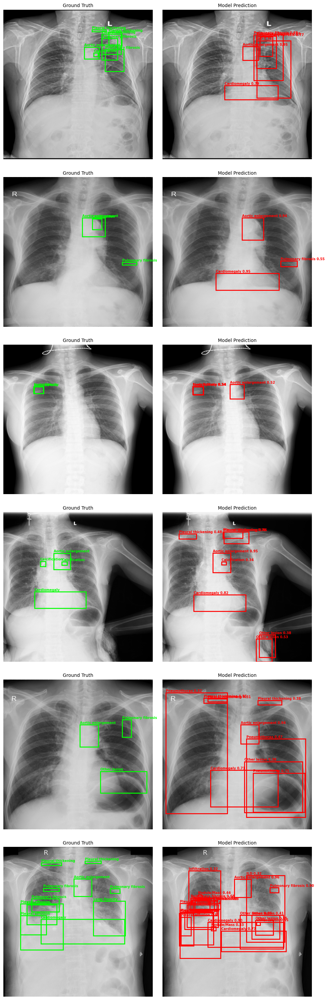
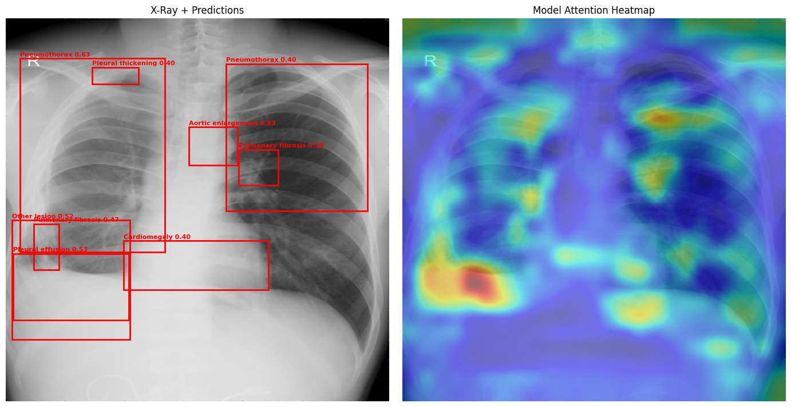

# Technical Report: Chest X-Ray Abnormality Detection

An end-to-end study of object detection for thoracic abnormalities in chest radiographs, covering model development, deployment, and — the main contribution — a rigorous evaluation of *why* the model performs as it does.

> **Educational / research demonstration only. Not a diagnostic device. Not clinically validated.**

**Live demo:** https://huggingface.co/spaces/rocky17435/xray-detection

---

## 1. Problem and Data

The task is multi-class object detection over 14 thoracic findings in chest X-rays, using the VinBigData Chest X-ray dataset.

**Label fusion.** Each image carries annotations from multiple radiologists, who frequently disagree on both presence and extent of findings. Rather than treating each annotation as independent ground truth, overlapping boxes were merged with Weighted Boxes Fusion, reducing 36,096 raw annotations to 22,719 consensus boxes (a 37% reduction). This produces a single coherent target per finding instead of clusters of near-duplicate boxes.

**Splits.** Stratified into 3,075 train / 659 validation / 660 test images. All results in this report are measured on the held-out test split unless stated otherwise.

**Class imbalance.** The dataset is severely imbalanced — roughly 65:1 between the most and least represented classes. Aortic enlargement appears in 974 training images; Atelectasis in 15. This imbalance turns out to be the central fact of the entire project.

---

## 2. Model Development

**Architecture.** Faster R-CNN with a ResNet-50 FPN backbone, initialised from COCO-pretrained weights.

**Class-balanced sampling.** A weighted sampler oversampled images containing rare findings by up to 28×, so that rare classes appeared with meaningful frequency during training.

**Training.** 20 epochs, SGD. Validation loss reached its minimum at epoch 4 and then rose steadily while training loss continued to fall — clear overfitting. The epoch-4 checkpoint was selected. This is itself informative: with 3,075 images, model capacity exceeds what the data supports.

**Test-time augmentation.** At inference the image is passed twice (original and horizontally flipped), with the two prediction sets fused via WBF. This improved mAP@0.5:0.95 from 0.126 to 0.132 at no training cost.

**Result:** mAP@0.5 = 0.290, mAP@0.5:0.95 = 0.132 — comparable to published competition baselines for this dataset.

---

## 3. Per-Class Analysis: The Central Finding

Overall mAP conceals a two-tier structure:

| Class | Train images | mAP@0.5:0.95 |
|---|---|---|
| Cardiomegaly | ~700 | 0.540 |
| Aortic enlargement | 974 | 0.508 |
| Pleural effusion | — | 0.098 |
| Nodule/Mass | — | 0.092 |
| ... | | |
| Calcification | ~30 | 0.028 |
| Other lesion | — | 0.014 |

Detection quality tracks training-set size almost monotonically. Two well-represented classes perform respectably; the remaining twelve cluster near zero.

**Hypothesis:** performance is limited by data availability, not by model architecture or training procedure.

The rest of this report tests that hypothesis three ways.

---

## 4. Evidence 1 — Qualitative Failure Analysis

Side-by-side ground truth (green) and predictions (red) across test images reveals a consistent pattern:

- **Well-represented classes are detected accurately and localised tightly** — Cardiomegaly and Aortic enlargement predictions closely match ground truth.
- **Data-scarce classes produce false positives.** On difficult images the model floods the field with low-confidence boxes for Pneumothorax, Other lesion, and Pleural thickening — findings it has seen only a handful of times and cannot discriminate.

The failure mode is not "missing findings" but "guessing" on classes it never learned.

---

## 5. Evidence 2 — Confidence Calibration

If the model is guessing on rare classes, its confidence scores should be untrustworthy. They were.

**Method.** 24,457 test predictions were scored for correctness (IoU > 0.4 against a same-class ground-truth box) and binned by confidence.

**Finding.** Expected Calibration Error was 0.046 overall — but this figure is misleading, because 73% of predictions fall below 0.2 confidence where the model happens to be well calibrated. Restricted to actionable predictions (score ≥ 0.25), **ECE was 0.155**: a prediction claiming 75% confidence was correct only 40% of the time.

**Temperature scaling failed.** The standard fix produced T = 1.018 and a 0.7% ECE reduction — essentially nothing. The reason is diagnostic: temperature scaling applies a single monotonic transform, but the miscalibration here is *non-uniform* — accurate at both extremes, badly over-confident in the middle. No single temperature can correct that shape.

**Isotonic regression worked.** Being non-parametric, it fits an arbitrary monotonic mapping. Fitted on the validation split and evaluated on test:

| | ECE (all) | ECE (score ≥ 0.25) |
|---|---|---|
| Raw | 0.0460 | 0.1554 |
| Temperature scaling | 0.0457 | — |
| **Isotonic** | **0.0037** | **0.0140** |

A 91% reduction in calibration error, both overall and where it matters.

**Deployed.** The calibrator is applied in the live demo, so displayed confidences reflect actual precision. It is stored as a plain JSON curve (`np.interp` lookup) rather than a pickled model object — version-independent and dependency-free.

Note that calibration does not improve detection accuracy; mAP is unchanged. It makes the confidence numbers *honest*, which for a medical demonstration matters independently.

---

## 6. Evidence 3 — Spatial Attention

Backbone feature-activation mapping shows the model attends to thoracic anatomy — cardiac silhouette and lung fields — rather than image borders or artifacts. It has learned anatomically meaningful features.

However, attention is *diffuse* rather than sharply localised, consistent with the over-prediction behaviour seen in the failure analysis.

---

## 7. Evidence 4 — Architecture Comparison

The strongest test of the data-scarcity hypothesis is interventional: change the architecture and see whether the limitation persists.

**Setup.** YOLOv8s trained on identical data, identical splits, identical 512px inputs, evaluated with the identical metric on the same 660 test images.

| | Faster R-CNN | YOLOv8s |
|---|---|---|
| Parameters | 41.3M | 11.1M |
| mAP@0.5 | 0.290 | **0.348** |
| mAP@0.5:0.95 | 0.132 | **0.180** |
| Inference | two-pass + WBF | 6.8 ms/image |

YOLOv8s outperforms Faster R-CNN **on all 14 classes** with roughly a quarter of the parameters.

**But the limitation persists.** Absolute gains concentrate in well-represented classes (Cardiomegaly +0.114, Aortic enlargement +0.083), while data-scarce classes remain unusable: Calcification 0.036, Other lesion 0.029. In relative terms the rare classes improved as much or more — Atelectasis and Pneumothorax both roughly doubled — but from a base so low that doubling changes nothing practical.

**Conclusion:** a substantially better architecture lifts performance across the board but cannot manufacture signal from 15 training examples. The binding constraint is data, not model.

*Caveat: the two models were trained with their conventional recipes (different epoch counts and augmentation stacks), so this compares architectures as normally trained rather than isolating architecture alone.*

---

## 8. Engineering

The model is served through a FastAPI service (JSON detections, annotated-image endpoint, DICOM support, input validation with size limits and graceful error handling), a React frontend with client-side threshold filtering and per-class toggles, and a Gradio app deployed on Hugging Face Spaces.

Practices applied: 7 endpoint tests covering happy paths and error cases; calibration validated on held-out data and shipped; version-independent artifact storage; honest scoping throughout.

---

## 9. Limitations

- Trained on a 3,075-image subset. Twelve of fourteen classes are effectively undetectable.
- Not clinically validated; no regulatory clearance. Educational demonstration only.
- Calibration is fitted to this dataset's distribution and would require refitting for other data.
- Performance on out-of-distribution radiographs (different equipment, populations) is untested.

## 10. What Would Actually Help

Not a better architecture — that was tested. The interventions that would move the needle are more data for rare classes (full VinDr-CXR access is pending), or reframing rare classes as anomaly detection rather than supervised detection.
